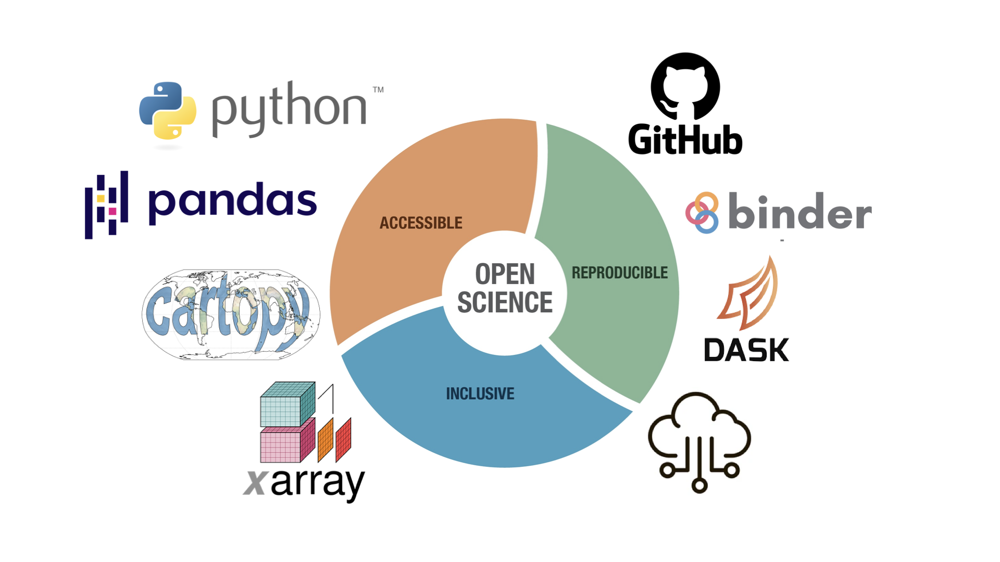

# Research Computing

**Fall 2023 | 16:107:606 Special Topics in Atmospheric Sciences**  
**Research Computing in Atmospheric and Environmental Sciences**  
**Rutgers University, Department of Environmental Sciences**

     
     
<!-- 
## Syllabus

* `mkdocs new [dir-name]` - Create a new project.
* `mkdocs serve` - Start the live-reloading docs server.
* `mkdocs build` - Build the documentation site.
* `mkdocs -h` - Print help message and exit.
 -->

<!-- 
## Project layout

    mkdocs.yml    # The configuration file.
    docs/
        index.md  # The documentation homepage.
        ...       # Other markdown pages, images and other files.
 -->
